<div align="center">


</div>

<h1 align="center">Intikhab Azam · AI Engineer & Systems Architect for Voice AI Agents, RAG, Machine Learning & Automation</h1>

I'm an **AI engineer and systems architect**. I design, build, fix and optimize **AI agents, voice AI, RAG systems, machine-learning models and business automations** that run in production: the kind that answer real phone calls, move real money and get used by people who don't care how they work.

```yaml
role:      AI engineer · systems architect · automation engineer · backend developer
building:  voice AI agents (Vapi + Twilio) · RAG chatbots · LLM tool-calling agents
architect: multi-tenant SaaS · BFF auth · field-level encryption · event-driven pipelines
ai stack:  Claude · Claude Code · MCP · n8n · OpenAI · Gemini · OpenRouter · ElevenLabs · Deepgram
also:      ML validation + forecasting · computer vision · lead generation · data pipelines
obsessed:  LLM cost optimization: prompt caching, model routing, token budgets
shipping:  production systems: voice agents, CRMs, lead-gen engines, ML research tools
```

## What I build


## System architecture


I design systems end to end, from the data model to the deploy pipeline. Patterns I use in production:

- **Multi-tenant SaaS**: shared schema with tenant keys and Postgres row-level security
- **BFF authentication**: httpOnly cookie sessions with token refresh owned in one place
- **Field-level encryption** for sensitive healthcare data, with key rotation and idempotent backfills
- **Event-driven pipelines**: webhooks, job queues, retries and idempotency keys
- **Edge compute**: Cloudflare Workers for payment links, SMS and API glue between voice agents and Stripe
- **LLM routing**: small models first, frontier models only when needed; cut one client's LLM spend by about 70%
- **Delivery**: Dockerized services, Kubernetes + NGINX, Prometheus monitoring and CI/CD gated on end-to-end tests

## Featured projects

<p align="center">
  <a href="https://github.com/intikhab49/edgeproof-crypto-trading-backtest"></a>
  <a href="https://github.com/intikhab49/vapi-voice-agent-crm"></a>
  <a href="https://github.com/intikhab49/local-business-lead-finder"></a>
  <a href="https://github.com/intikhab49/secureface-liveness-detection"></a>
  <a href="https://github.com/intikhab49/ai-wealth-advisor"></a>
  <a href="https://github.com/intikhab49/cryptoaion-price-prediction"></a>
  <a href="https://github.com/intikhab49/npi-healthcare-lead-pipeline"></a>
  <a href="https://github.com/intikhab49/kubernetes-flask-microservices"></a>
</p>

<details>
<summary><b>All repositories, with details</b></summary>
<br/>

| Repository | What it is | Stack |
| --- | --- | --- |
| [edgeproof-crypto-trading-backtest](https://github.com/intikhab49/edgeproof-crypto-trading-backtest) | Crypto trading backtesting & ML validation: triple-barrier labels, purged CV, deflated Sharpe and a planted-edge control | Python · LightGBM · PyTorch |
| [vapi-voice-agent-crm](https://github.com/intikhab49/vapi-voice-agent-crm) | CRM & call-ops backend for Vapi AI voice agents: webhooks, predictive dialer, auto-redial, Stripe-verified conversions | Node.js · Express · Twilio · Stripe |
| [local-business-lead-finder](https://github.com/intikhab49/local-business-lead-finder) | Lead generation engine: grid search past the Google Places cap, OpenStreetMap fallback, e-mail enrichment | Python · FastAPI · Streamlit |
| [secureface-liveness-detection](https://github.com/intikhab49/secureface-liveness-detection) | Face recognition access control with head-pose liveness, rPPG pulse detection and ChromaDB matching | InsightFace · OpenCV · Streamlit |
| [ai-wealth-advisor](https://github.com/intikhab49/ai-wealth-advisor) | RAG + tool-calling financial assistant: VaR, Sharpe, drawdown, diversification scoring | LangChain · Gemini · Flask |
| [cryptoaion-price-prediction](https://github.com/intikhab49/cryptoaion-price-prediction) | BiLSTM + attention crypto price prediction API with WebSocket streaming and JWT auth | PyTorch · FastAPI |
| [npi-healthcare-lead-pipeline](https://github.com/intikhab49/npi-healthcare-lead-pipeline) | NPI Registry → practice websites → e-mails, resumable and scheduled on GitHub Actions | Python · GitHub Actions |
| [kubernetes-flask-microservices](https://github.com/intikhab49/kubernetes-flask-microservices) | Flask microservices on Kubernetes with NGINX, PostgreSQL, a logging service and Prometheus | Flask · Kubernetes · Docker |
| [kubernetes-flask-crud](https://github.com/intikhab49/kubernetes-flask-crud) | Flask + PostgreSQL behind NGINX on Minikube with NetworkPolicies | Flask · Kubernetes · NGINX |
| [flask-postgres-crud-dashboard](https://github.com/intikhab49/flask-postgres-crud-dashboard) | User management CRUD app with a Chart.js analytics dashboard | Flask · PostgreSQL · Docker |
| [react-express-drizzle-crud](https://github.com/intikhab49/react-express-drizzle-crud) | Full-stack TypeScript CRUD with Passport session auth | React · Express · Drizzle · Neon |
| [devops-agency-website](https://github.com/intikhab49/devops-agency-website) | DevOps agency site with a pricing calculator and contact API | React · TypeScript · Tailwind |
| [crypto-price-prediction-api](https://github.com/intikhab49/crypto-price-prediction-api) | v1 of CryptoAion with BiLSTM and XGBoost research notebooks | FastAPI · PyTorch |
| [ubuntu-dev-tools-installer](https://github.com/intikhab49/ubuntu-dev-tools-installer) | Interactive Bash installer for Python, VS Code, Docker, Jenkins, kubectl | Bash |
| [libncurses5-libaio1-ubuntu-deb](https://github.com/intikhab49/libncurses5-libaio1-ubuntu-deb) | Legacy `libaio1` / `libncurses5` / `libtinfo5` `.deb` packages for newer Ubuntu | Ubuntu · dpkg |
| [cpp-queue-data-structure](https://github.com/intikhab49/cpp-queue-data-structure) | Array-based FIFO queue in C++ | C++ |

</details>

## Tech stack


## Live GitHub stats


<sub>Drawn daily by this repo's own GitHub Action. No third-party stats service.</sub>

## Work with me

I take on **contract and freelance work**:

- **System architecture**: multi-tenant SaaS design, auth and data security, scaling and cost reviews
- **AI agent workflows**: Claude, MCP and n8n agents across Slack, Notion and CRMs
- **AI voice agents**: Vapi / Twilio receptionists, outbound callers, call-to-CRM pipelines
- **RAG chatbots & LLM agents**: knowledge bases, tool calling, memory, evaluation
- **LLM cost optimization**: cutting token spend with caching, routing and smaller models
- **ML validation**: finding out whether a model's backtest is real before money rides on it
- **Automation**: lead generation, scraping + enrichment, CRM and payment integrations

<a href="https://github.com/intikhab49"></a>

<div align="center">
<sub>AI engineer · systems architect · software architect · solutions architect · multi-tenant SaaS architecture · Claude AI developer · MCP · n8n automation expert · voice AI agent developer · Vapi developer · Twilio voice bot · RAG chatbot developer · LLM agents · LangChain developer · machine learning engineer · algorithmic trading backtesting · computer vision · Python developer · FastAPI · automation engineer · lead generation automation · LLM cost optimization · freelance AI engineer</sub>
</div>
