<picture>
  <source media="(prefers-color-scheme: dark)" srcset="assets/hero-dark.svg">
  <source media="(prefers-color-scheme: light)" srcset="assets/hero-light.svg">
  
</picture>

# Intikhab Azam · AI Engineer for Voice AI Agents, RAG, Machine Learning & Automation

I build **AI systems that do real work in production**: **voice AI agents** that answer and place phone calls, **RAG chatbots and tool-calling LLM agents**, **machine-learning and quantitative research** tools that test whether a trading edge is real, and **business automations** that move leads, payments and data without anyone touching them.

I care about what happens after the demo. That means evaluation that can't fool itself, **LLM cost optimization** (prompt caching, model routing, token budgets), and systems that keep working when real users do unexpected things.

## What I build

<table>
<tr>
<td width="50%" valign="top">

**`01` Voice AI agents** 
Inbound receptionists and outbound callers on **Vapi** and **Twilio**, wired into CRMs, payment portals, webhooks and predictive dialers, with call analytics and conversion tracking.

</td>
<td width="50%" valign="top">

**`02` RAG & LLM applications** 
Retrieval-augmented chatbots and **tool-calling AI agents** with memory, built on **LangChain**, **ChromaDB**, **OpenAI**, **Gemini** and **OpenRouter**, model-agnostic by design.

</td>
</tr>
<tr>
<td width="50%" valign="top">

**`03` Machine learning & quant research** 
**Backtesting and ML validation** with triple-barrier labels, purged cross-validation and deflated Sharpe; **BiLSTM** and **LightGBM** forecasting; **face recognition** with liveness detection.

</td>
<td width="50%" valign="top">

**`04` Automation & data pipelines** 
**Lead generation** engines, scraping and e-mail enrichment, scheduled **GitHub Actions** jobs, and **FastAPI** / **Express** backends with **Streamlit** dashboards.

</td>
</tr>
</table>

## Selected work

| Nº | Project | What it does | Built with |
|:--:|---|---|---|
| `01` | **[EdgeProof](https://github.com/intikhab49/edgeproof-crypto-trading-backtest)** crypto trading backtesting & ML validation | Tests whether a trading strategy or ML model has a real edge after fees. A planted-edge control proves the harness can find one; on 15m BTC/ETH/SOL data, no directional model survived. | Python · LightGBM · PyTorch |
| `02` | **[Vapi Voice Agent CRM](https://github.com/intikhab49/vapi-voice-agent-crm)** call-ops backend for AI voice agents | Vapi webhook ingestion, predictive dialer, auto-redial and payment-verified conversions reconciled against Stripe and the client portal. | Node.js · Express · Twilio · Stripe |
| `03` | **[Local Business Lead Finder](https://github.com/intikhab49/local-business-lead-finder)** self-hosted lead generation engine | Grid search past the Google Places 60-result cap, free OpenStreetMap fallback, dedup, adaptive rate limiting and resumable runs. | Python · FastAPI · Streamlit |
| `04` | **[SecureFace](https://github.com/intikhab49/secureface-liveness-detection)** face recognition with anti-spoofing | Blocks photo and video replay attacks with a head-pose challenge and rPPG pulse detection before ArcFace matching. | InsightFace · OpenCV · ChromaDB |
| `05` | **[AI Wealth Advisor](https://github.com/intikhab49/ai-wealth-advisor)** RAG + tool-calling finance agent | Portfolio risk (VaR, Sharpe, max drawdown), diversification scoring and strategy design with conversational memory. | LangChain · Gemini · Flask |
| `06` | **[CryptoAion](https://github.com/intikhab49/cryptoaion-price-prediction)** crypto price prediction API | BiLSTM + attention forecasts on 30m, 1h, 4h and 24h timeframes, streamed live over WebSockets with JWT auth. | PyTorch · FastAPI · WebSockets |
| `07` | **[NPI Healthcare Lead Pipeline](https://github.com/intikhab49/npi-healthcare-lead-pipeline)** automated B2B lead pipeline | NPI Registry providers → practice websites → e-mail extraction, resume-safe and scheduled on GitHub Actions with zero paid APIs. | Python · NPPES API · Actions |

<b>More repositories: DevOps, full-stack and utilities</b>

 

| Repository | What it is | Stack |
|---|---|---|
| [kubernetes-flask-microservices](https://github.com/intikhab49/kubernetes-flask-microservices) | Flask microservices on Kubernetes with NGINX, a logging service, PostgreSQL and Prometheus | Flask · Kubernetes · Docker |
| [kubernetes-flask-crud](https://github.com/intikhab49/kubernetes-flask-crud) | Flask + PostgreSQL behind NGINX on Minikube, with NetworkPolicies and a Docker Swarm stack | Flask · Kubernetes · NGINX |
| [flask-postgres-crud-dashboard](https://github.com/intikhab49/flask-postgres-crud-dashboard) | User management CRUD app with a Chart.js analytics dashboard | Flask · PostgreSQL · Docker |
| [react-express-drizzle-crud](https://github.com/intikhab49/react-express-drizzle-crud) | Full-stack TypeScript CRUD with Passport session auth | React · Express · Drizzle · Neon |
| [devops-agency-website](https://github.com/intikhab49/devops-agency-website) | DevOps agency site with a pricing calculator and contact API | React · TypeScript · Tailwind |
| [crypto-price-prediction-api](https://github.com/intikhab49/crypto-price-prediction-api) | v1 of CryptoAion, with BiLSTM and XGBoost research notebooks | FastAPI · PyTorch |
| [ubuntu-dev-tools-installer](https://github.com/intikhab49/ubuntu-dev-tools-installer) | Interactive Bash installer for Python, VS Code, Docker, Jenkins and kubectl | Bash |
| [libncurses5-libaio1-ubuntu-deb](https://github.com/intikhab49/libncurses5-libaio1-ubuntu-deb) | Legacy `libaio1` / `libncurses5` / `libtinfo5` `.deb` packages for newer Ubuntu | Ubuntu · dpkg |
| [cpp-queue-data-structure](https://github.com/intikhab49/cpp-queue-data-structure) | Array-based FIFO queue in C++ | C++ |

## Stack

<picture>
  <source media="(prefers-color-scheme: dark)" srcset="assets/stack-dark.svg">
  <source media="(prefers-color-scheme: light)" srcset="assets/stack-light.svg">
  
</picture>

Python · PyTorch · LightGBM · XGBoost · scikit-learn · LangChain · ChromaDB · OpenAI · Gemini · Vapi · Twilio · FastAPI · Flask · Node.js · Express · PostgreSQL · MySQL · SQLite · MongoDB · Stripe · React · TypeScript · Vite · Tailwind CSS · Astro · Streamlit · Docker · Kubernetes · NGINX · Prometheus · GitHub Actions · Cloudflare · Vercel · Linux · Bash

## Field log

<picture>
  <source media="(prefers-color-scheme: dark)" srcset="https://raw.githubusercontent.com/intikhab49/intikhab49/output/field-log-dark.svg">
  <source media="(prefers-color-scheme: light)" srcset="https://raw.githubusercontent.com/intikhab49/intikhab49/output/field-log-light.svg">
  
</picture>

Rebuilt daily by this repo's own GitHub Action from the GitHub API. No third-party stats service.

## Work with me

I take on **contract and freelance work**:

- **AI voice agents**: Vapi / Twilio receptionists, outbound callers, call-to-CRM pipelines
- **RAG chatbots & LLM agents**: knowledge bases, tool calling, memory, evaluation
- **LLM cost optimization**: cutting token spend with caching, routing and smaller models
- **ML validation**: finding out whether a model's backtest is real before money rides on it
- **Automation**: lead generation, scraping and enrichment, CRM and payment integrations

Have a system that's slow, expensive or unreliable? Open an issue on any repository to start a conversation.

<picture>
  <source media="(prefers-color-scheme: dark)" srcset="assets/footer-dark.svg">
  <source media="(prefers-color-scheme: light)" srcset="assets/footer-light.svg">
  
</picture>

AI engineer · voice AI agent developer · Vapi developer · Twilio voice bot · RAG chatbot developer · LLM agent · LangChain developer · machine learning engineer · algorithmic trading backtesting · quantitative research · Python developer · FastAPI · automation engineer · lead generation automation · LLM cost optimization · freelance AI engineer
