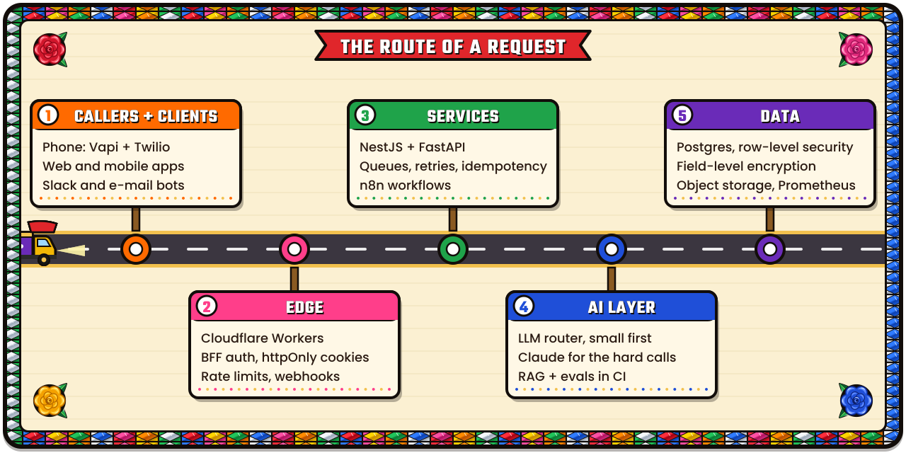

<a href="https://github.com/intikhab49"></a>

<h1 align="center">Intikhab Azam · AI/ML Engineer, Researcher & Systems Architect</h1>

<b>Voice AI agents · RAG and LLM evaluation · multi-tenant SaaS · agentic coding · open-source AI tools</b>

I build AI systems that have to work in production: **voice agents** that answer real phone calls, **RAG and LLM agents** judged by cost per correct answer, and **multi-tenant SaaS platforms** with row-level security and field-level encryption. I also publish the research behind them, including the numbers that went against me. Based in Pakistan, working with US teams, **open to contract work**.

## What I build



- **AI voice agents**: Vapi and Twilio receptionists and outbound callers, wired into CRMs, payments and SMS
- **RAG and LLM agents**: knowledge-base chatbots with tool calling and memory, evaluated by cost per correct answer
- **LLM evals and research**: calibration, benchmarks and backtests that report the losing numbers too
- **Multi-tenant SaaS architecture**: Postgres row-level security, BFF auth, field-level encryption, event-driven jobs
- **Agentic coding**: Claude Code, Codex and DeepSeek working in parallel behind spec files, a claims board and test gates
- **Automation and data pipelines**: n8n, Cloudflare Workers, lead generation, scraping and enrichment

## Open-source AI projects

  <a href="https://github.com/intikhab49/open-jev-typed-decision-engine"></a>
  <a href="https://github.com/intikhab49/pushback"></a>
  <a href="https://github.com/intikhab49/diff-gate"></a>
  <a href="https://github.com/intikhab49/rag-cost-curve"></a>
  <a href="https://github.com/intikhab49/minio-from-source"></a>
  <a href="https://github.com/intikhab49/vapi-voice-agent-crm"></a>
  <a href="https://github.com/intikhab49/edgeproof-crypto-trading-backtest"></a>
  <a href="https://github.com/intikhab49/local-business-lead-finder"></a>

<b>All public repositories, with details</b>

 

| Repository | What it is | Stack |
| --- | --- | --- |
| [open-jev-typed-decision-engine](https://github.com/intikhab49/open-jev-typed-decision-engine) | Open reproduction of TypeSafe Jev: a 150M typed decision engine (noul / choice / score) with calibrated confidence | Python · PyTorch · ModernBERT |
| [pushback](https://github.com/intikhab49/pushback) | Measures how often you correct your Claude Code agent, drafts CLAUDE.md rules, exports DPO pairs | Python · CLI · PyPI |
| [minio-from-source](https://github.com/intikhab49/minio-from-source) | MinIO server + mc built from source at pinned releases, multi-arch images on GHCR | Docker · GitHub Actions |
| [diff-gate](https://github.com/intikhab49/diff-gate) | Fails on imports an AI coding agent invented, before attackers can register them | JavaScript · GitHub Action |
| [rag-cost-curve](https://github.com/intikhab49/rag-cost-curve) | Cost per correct answer for agentic, iterative, reranked and naive RAG on MuSiQue | Python · Claude |
| [edgeproof-crypto-trading-backtest](https://github.com/intikhab49/edgeproof-crypto-trading-backtest) | Backtesting and ML validation: triple-barrier labels, purged CV, deflated Sharpe, a planted-edge control | Python · LightGBM · PyTorch |
| [local-business-lead-finder](https://github.com/intikhab49/local-business-lead-finder) | Lead generation past the Google Places cap, OpenStreetMap fallback, e-mail enrichment | Python · FastAPI · Streamlit |
| [vapi-voice-agent-crm](https://github.com/intikhab49/vapi-voice-agent-crm) | CRM and call-ops backend for Vapi voice agents: webhooks, predictive dialer, Stripe-verified conversions | Node.js · Express · Twilio · Stripe |
| [secureface-liveness-detection](https://github.com/intikhab49/secureface-liveness-detection) | Face recognition access control with head-pose liveness, rPPG pulse detection and ChromaDB matching | InsightFace · OpenCV · Streamlit |
| [ai-wealth-advisor](https://github.com/intikhab49/ai-wealth-advisor) | RAG + tool-calling financial assistant: VaR, Sharpe, drawdown, diversification scoring | LangChain · Gemini · Flask |
| [cryptoaion-price-prediction](https://github.com/intikhab49/cryptoaion-price-prediction) | BiLSTM + attention crypto price prediction API with WebSocket streaming and JWT auth | PyTorch · FastAPI |
| [npi-healthcare-lead-pipeline](https://github.com/intikhab49/npi-healthcare-lead-pipeline) | NPI Registry to practice websites to e-mails, resumable and scheduled on GitHub Actions | Python · GitHub Actions |
| [kubernetes-flask-microservices](https://github.com/intikhab49/kubernetes-flask-microservices) | Flask microservices on Kubernetes with NGINX, PostgreSQL, a logging service and Prometheus | Flask · Kubernetes · Docker |
| [kubernetes-flask-crud](https://github.com/intikhab49/kubernetes-flask-crud) | Flask + PostgreSQL behind NGINX on Minikube with NetworkPolicies | Flask · Kubernetes · NGINX |
| [flask-postgres-crud-dashboard](https://github.com/intikhab49/flask-postgres-crud-dashboard) | User management CRUD app with a Chart.js analytics dashboard | Flask · PostgreSQL · Docker |
| [react-express-drizzle-crud](https://github.com/intikhab49/react-express-drizzle-crud) | Full-stack TypeScript CRUD with Passport session auth | React · Express · Drizzle · Neon |
| [devops-agency-website](https://github.com/intikhab49/devops-agency-website) | DevOps agency site with a pricing calculator and contact API | React · TypeScript · Tailwind |
| [crypto-price-prediction-api](https://github.com/intikhab49/crypto-price-prediction-api) | v1 of CryptoAion with BiLSTM and XGBoost research notebooks | FastAPI · PyTorch |
| [ubuntu-dev-tools-installer](https://github.com/intikhab49/ubuntu-dev-tools-installer) | Interactive Bash installer for Python, VS Code, Docker, Jenkins, kubectl | Bash |
| [libncurses5-libaio1-ubuntu-deb](https://github.com/intikhab49/libncurses5-libaio1-ubuntu-deb) | Legacy `libaio1` / `libncurses5` / `libtinfo5` `.deb` packages for newer Ubuntu | Ubuntu · dpkg |
| [git-notes](https://github.com/intikhab49/git-notes) | Working notes on git internals and GitHub Actions | Markdown |
| [cpp-queue-data-structure](https://github.com/intikhab49/cpp-queue-data-structure) | Array-based FIFO queue in C++ | C++ |

## System architecture



I design systems end to end, from the data model to the deploy pipeline. Patterns I use in production:

- **Multi-tenant SaaS**: shared schema with tenant keys, Postgres row-level security and cross-tenant tests in CI
- **BFF authentication**: httpOnly cookie sessions with token refresh owned in one place
- **Field-level encryption** for sensitive personal data, with key rotation and idempotent backfills
- **Event-driven pipelines**: webhooks, job queues, retries and idempotency keys
- **Edge compute**: Cloudflare Workers for payment links, SMS and API glue between voice agents and Stripe
- **LLM routing**: small models first, frontier models only when needed, prompt caching to cut token spend
- **Delivery**: Docker, Kubernetes + NGINX, Prometheus, and end-to-end tests that run against real data, not just mocks

## Tech stack

## Live GitHub stats

Redrawn every day by this repo's own GitHub Action. No third-party stats service.

## Work with me

I take on **contract and freelance work**:

- **AI voice agents**: receptionists, outbound callers, call-to-CRM and payment flows on Vapi and Twilio
- **RAG chatbots and LLM agents**: knowledge bases, tool calling, memory and evaluation
- **LLM cost and quality**: benchmarks, calibration, prompt caching and model routing
- **System architecture**: multi-tenant SaaS design, auth and data security, scaling and cost reviews
- **Agentic coding setups**: Claude Code skills, MCP servers and CI gates for AI-written code
- **Automation**: n8n workflows, lead generation, scraping, CRM and payment integrations

Every image on this page is hand-coded, animated SVG in the style of Pakistani truck art, drawn by <a href=".github/scripts/build_art.py">build_art.py</a>. <b>Dekh magar pyar se</b>: look, but with love.
  
AI engineer · machine learning engineer · LLM engineer · AI researcher · systems architect · voice AI agent developer · Vapi · Twilio · RAG · agentic RAG · LLM evaluation · calibration · Claude Code · MCP · multi-tenant SaaS · Python · PyTorch · FastAPI · NestJS · remote AI engineer in Pakistan

